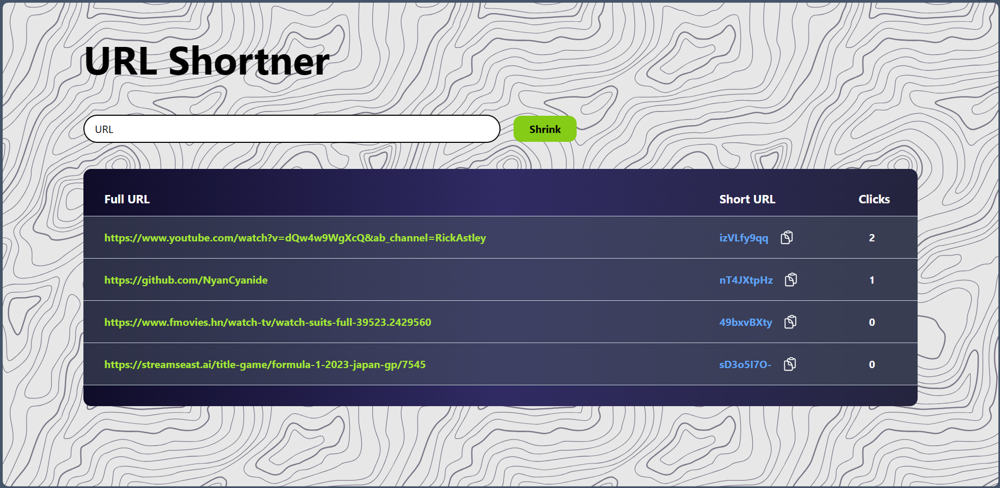
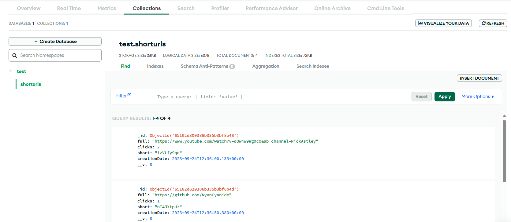

# URL Shortener

   

## Overview

The URL Shortener is a web application developed using Node.js, Express.js, EJS, and MongoDB. Its main purpose is to convert long URLs into short, user-friendly links. Users can use these short URLs to easily access the original, lengthy URLs without having to type them.

### Features

-   Converts long URLs into short, unique links.
-   Short URLs expire after 30 days.
-   Counts the number of clicks on each short URL.
-   Stores data in MongoDB, including long URLs, short URLs, click counts, and creation dates.

## Tech Stack

-   **Node.js**: JavaScript runtime environment.
-   **Express.js**: Web application framework for Node.js.
-   **EJS (Embedded JavaScript)**: Templating engine for rendering dynamic content.
-   **MongoDB**: NoSQL database for storing URL and click data.

## MongoDB Schema

The MongoDB database used in this project has the following schema:

1.  **Long URL**: String - The original, lengthy URL.
2.  **Short URL**: String (8 characters) - A unique short URL.
3.  **Clicks**: Number - Counts the number of times the short URL has been clicked.
4.  **Creation Date**: Date - Keeps track of when the record was created. Records are automatically deleted after 30 days.

## Usage

To use the URL shortener:

1.  Clone this repository to your local machine.
2.  Install the required Node.js packages using `npm install`.
3.  Set up MongoDB and configure the database connection in the application by adding appropriate username and password.
4.  Start the server using `npm run dev`.
5.  Visit the application in your web browser at localhost:8080.
6.  Enter a long URL, and the application will generate a short URL for you.

## Screenshots

## Deployment

You can deploy this application to a cloud server or hosting platform of your choice. Make sure to set up environment variables for sensitive information such as database credentials.

## Contributing

Contributions are welcome! If you'd like to contribute to this project.